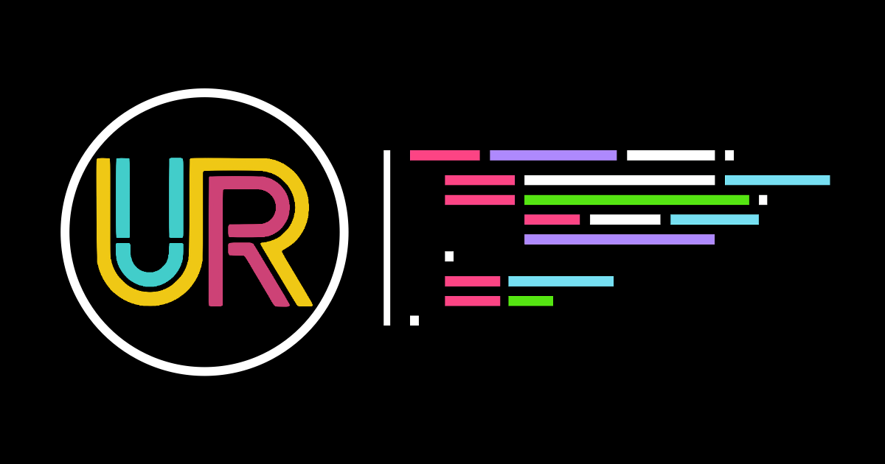

# Uddebo Radio Client

A community-driven web radio platform where anyone can upload and share audio recordings. Built with Svelte, TypeScript, and Supabase, this application provides a simple and accessible way for communities to create and broadcast their own radio content.

## Database structure

## Recording

An recording is an audio file with the following related metadata:

- id: the uuid of the recording
- edited_at: the timestamp of the last update
- edited_by (optional): the uuid of the user who last edited the recording, set only if signed in user when editing
- uploaded_at: the timestamp of the upload (creation) of the recording
- uploaded_filename: the filename of the audio file when uploaded
- uploaded_by (optional): the uuid of the user who uploaded the recording, set only if signed in user when uploading
- duration: the duration of the recording in seconds
- file_size: the size of the recording in bytes
- file_url: the url of the audio file in Supabase Storage, also used for streaming
- title (optional): a given descriptive name of the recording
- author (optional): a given name to display as the author of the recording
- description (optional): a longer textual description of the recording to display in the media player
- link_out_url (optional): an optional url to display as an external link out for promotional purposes
- captions_url (optional): a .json file containing the captions for the recording
- cover_url (optional): a file in storage and url to an image to display as the cover art for the recording in the media player
- type: either 'unknown', 'rejected', 'music', 'news', 'commentary', 'talk', 'comedy', 'talkshow', 'interview', 'jingle' or 'other'

Anybody can create an recording by uploading a file to though the client gui but only signed in admin users can edit or delete them.

## Broadcast Program

A Broadcast Program is a collection of recordings that are played together as a single program. It has the following metadata:

- id: the uuid of the broadcast program
- edited_at: the timestamp of the last update
- edited_by (optional): the uuid of the user who last edited the broadcast program, set only if signed in user when editing
- created_at: the timestamp of the creation of the broadcast program
- created_by (optional): the uuid of the user who created the broadcast program, set only if signed in user when creating
- title: a given descriptive name of the broadcast program
- description (optional): a longer textual description of the broadcast program to display in the media player
- cover_url (optional): a file in storage and url to an image to display as the cover art for the broadcast program in the media player
- is_active: a boolean indicating whether the broadcast program is active or not, that is it will be played in the media player at the set start time
- start_time: the timestamp of the start time of the broadcast program
- recordings: a json array of recording ids of order to be played in the media player

Only admin users can create, edit, or delete broadcast programs.

# Users

## Admin users

As of now all users are admin users, and authenticate using their email address though Supabase. 

Its not possible to add admin users through the client gui, they have to be added through the Supabase dashboard.
