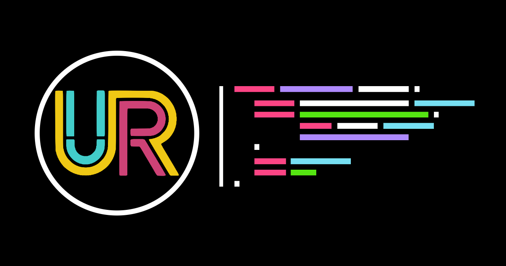

# Uddebo Radio Client

A community-driven web radio platform where anyone can upload and share audio recordings. Built with Svelte, TypeScript, and PocketBase.

## Development

```bash
npm install
npm run pocketbase   # start PocketBase on localhost:8090
npm run dev          # start Vite dev server
```

Requires a PocketBase binary at `pocketbase/pocketbase`. Copy `.env.example` to `.env` and adjust if needed.

To regenerate TypeScript types from the live PocketBase schema:

```bash
npm run pocketbase:generate-types
```

## Data model

**Recording** — an audio file with metadata: title, author, description, type, duration, cover image, captions, and an approval timestamp (`okey_at`). Anyone can upload; only admins can edit or delete.

**Broadcast Program** — an ordered list of recordings played as a single scheduled broadcast. Has a `start_time`, an `is_active` flag, and an optional cover image. Only admins can manage programs.

**Visitor Stats** — one row per page visit, used to compute traffic statistics shown in the admin panel.

## Admin users

Admin users authenticate with email and password via PocketBase. New admins must be added through the PocketBase admin UI at `localhost:8090/_/`.
